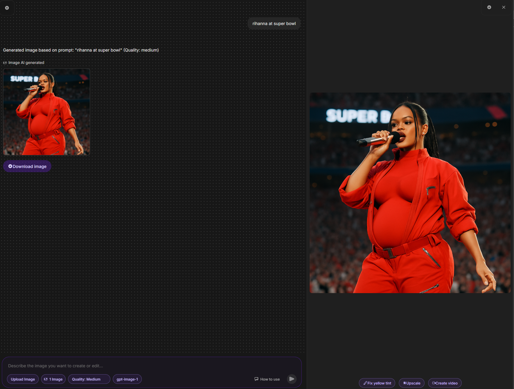

# Lilac AI Text-to-Image Chatbot

This is a simple web-based chatbot application that allows users to generate and edit images using OpenAI's `gpt-image-1` model. It features a chat interface where users can interact with the AI by providing text prompts and optionally uploading images for context-based editing.

 

## Key Features

*   **Text-to-Image Generation:** Generate images from text prompts using `gpt-image-1`.
*   **Image Context Editing:** Upload images or use previously generated images as context for subsequent editing prompts (supports up to 10 context images).
*   **Image Quality Selection:** Choose between "Auto", "Low", "Medium", and "High" quality settings for image generation/editing to manage speed and potential API costs.
*   **Chat Interface:** Familiar chat UI for interaction.
*   **Image Preview:** Click on AI-generated image thumbnails to view a larger preview.
*   **Download:** Download generated/edited images directly from the chat or the preview panel.
*   **Backend Proxy:** A Node.js/Express backend protects the OpenAI API key.

## Technology Stack

*   **Frontend:** HTML, CSS, TypeScript, Vite
*   **Backend:** Node.js, Express, TypeScript
*   **AI Model:** OpenAI `gpt-image-1` (via `openai` Node.js SDK)

## Prerequisites

*   Node.js (v18 or later recommended)
*   npm (usually comes with Node.js)
*   An OpenAI API Key with access to the `gpt-image-1` model.

## Setup

1.  **Clone the Repository:**
    ```bash
    git clone <your-repository-url>
    cd <your-repository-directory>
    ```

2.  **Install Frontend Dependencies:**
    Navigate to the project root directory (where `package.json` for Vite is located) and run:
    ```bash
    npm install
    ```

3.  **Install Backend Dependencies:**
    Navigate to the `server` directory and run:
    ```bash
    cd server
    npm install
    cd ..
    ```

4.  **Configure Backend (API Key):**
    *   Navigate to the `server` directory: `cd server`
    *   Create a new file named `.env` in the `server` directory.
    *   Open the `.env` file and add your OpenAI API key:
        ```dotenv
        OPENAI_API_KEY=sk-YourActualOpenAiApiKeyHere
        # You can optionally add a PORT variable, otherwise it defaults to 3001
        # PORT=3001
        ```
    *   **Important:** Ensure the `server/.env` file is listed in the `server/.gitignore` file (it should be by default) to prevent accidentally committing your API key.
    *   Navigate back to the root directory: `cd ..`

## Running the Application

You need to run both the frontend (Vite dev server) and the backend (Node.js/Express server) simultaneously in separate terminals.

1.  **Start the Backend Server:**
    Open a terminal in the project root directory and run:
    ```bash
    cd server
    npm run dev
    ```
    This uses `ts-node-dev` to run the TypeScript server and automatically restart it on file changes. It should log that the server is running, typically on port 3001.

2.  **Start the Frontend Dev Server:**
    Open a *second* terminal in the project root directory and run:
    ```bash
    npm run dev
    ```
    This starts the Vite development server, usually on port 5173. It will open the application in your default web browser.

## Usage

1.  **Open the App:** Access the URL provided by the Vite server (e.g., `http://localhost:5173`).
2.  **Sending Prompts:** Type a description of the image you want to create in the text area at the bottom and press Enter or click the Send button.
3.  **Uploading Images:** Click the "Upload Image" button to select an image file from your computer. The image will be added to the context list automatically and shown in a small preview above the text area. Sending a prompt after uploading will use this image (and others in the context) for editing.
4.  **Image Context:**
    *   Both uploaded images and images generated by the AI are automatically added to a context list (up to a maximum of 10 images, FIFO).
    *   The pill button showing "X Images" indicates the current number of images in the context being sent with your next prompt.
    *   Clicking the "X Images" pill **clears the entire image context**.
5.  **Selecting Quality:** Use the "Quality: ..." dropdown button to select the desired image quality ("Auto", "Low", "Medium", "High") for the next image generation or edit request. "Low" might be faster and cheaper, while "High" aims for better visual detail.
6.  **Viewing & Downloading:**
    *   Click on any AI-generated image thumbnail in the chat to open a larger preview panel on the right.
    *   Click the "Download image" button below an AI message thumbnail to download it directly.
    *   Click the download icon button in the header of the preview panel to download the currently previewed image.

## Known Issues & Limitations

*   **Image Generation Latency:** Generating images, especially complex ones or at higher quality settings, can take some time. A loading indicator is shown during this process.
*   **Cost:** Image generation via the OpenAI API incurs costs based on image size and quality settings. Be mindful of your usage. Refer to OpenAI pricing for details.
*   **Error Handling:** Basic error handling for API and network issues is implemented, displaying messages in the chat. More specific error feedback could be added.
*   **Size Parameter:** Currently, the image size is fixed at `1024x1024` in the backend. Adding UI options for different sizes (square, portrait, landscape) could be a future enhancement.

---

Happy Image Generating!
