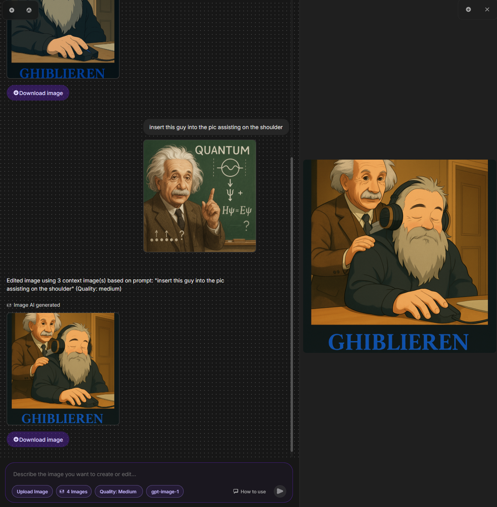

# Lilac AI Text-to-Image Chatbot

[](https://www.typescriptlang.org/)
[](https://nodejs.org/)
[](https://reactjs.org/)
[](https://vitejs.dev/)
[](https://expressjs.com/)
[](https://openai.com/)
[](https://cloud.google.com/vertex-ai)
[](https://opensource.org/licenses/MIT)

A simple, elegant chatbot interface demonstrating text-to-image generation using **OpenAI's `gpt-image-1` model** and **Google's Gemini 2.0 Flash model via Vertex AI**. Features include image uploads for context, quality selection (for OpenAI), streaming responses, and a clean UI.



## Overview

This project provides a web-based chat interface that connects to a backend server. Users can interact with state-of-the-art AI models featuring native image generation capabilities based on text prompts. It also supports uploading images to provide visual context for subsequent requests (image+text -> image/text).

**New:** The chatbot now supports two powerful AI models with integrated image generation:
*   **GPT-image-1:** Utilizes OpenAI's dedicated `gpt-image-1` model for high-quality image generation directly via their API.
*   **Google Gemini 2.0 Flash:** Utilizes Google's multimodal model via Vertex AI, capable of natively generating both text and images, and understanding image context for iterative generation or modification.

## Features

*   **Dual Model Support:** Seamlessly switch between GPT-image-1 and Google Gemini Flash using a UI dropdown.
*   **Text-to-Image Generation:** Enter a text prompt and receive an AI-generated image directly from the selected model's native capabilities.
*   **Image Context:** Upload an image alongside your text prompt. The AI uses the image context for tasks like editing, analysis, or related generation.
*   **Text + Image Output (Gemini):** Gemini can respond with both generated text and images in a single turn.
*   **Clean Chat Interface:** A simple and intuitive chat UI built with React and TypeScript.
*   **Streaming Responses:** Text responses from the AI are streamed for a more interactive feel.
*   **Backend Server:** A Node.js/Express server handles API requests to OpenAI (using the `gpt-image-1` model) and Google Cloud Vertex AI.
*   **Easy Setup:** Uses Vite for a fast frontend development experience and standard Node.js for the backend.
*   **Customizable Quality (OpenAI):** Select 'Low', 'Medium', 'High' or 'Auto' quality for OpenAI image generation (*Note: This parameter might be specific to how the API handles quality for `gpt-image-1`*).
*   **Responsive Design:** Basic responsiveness for different screen sizes.

## Tech Stack

*   **Frontend:** React, TypeScript, Vite, CSS
*   **Backend:** Node.js, Express, TypeScript
*   **AI APIs:**
    *   OpenAI API (`openai` npm package, model: `gpt-image-1`)
    *   Google Generative AI API via Vertex AI (`@google/generative-ai` npm package, model: `gemini-2.0-flash-exp`)

## Setup and Installation

1.  **Prerequisites:**
    *   Node.js (v18 or later recommended)
    *   npm (usually comes with Node.js)
    *   Git
    *   **OpenAI API Key:** Get one from [platform.openai.com](https://platform.openai.com/). Ensure your account has access to the `gpt-image-1` model.
    *   **Google Cloud Project & Vertex AI Enabled:**
        *   Create a Google Cloud project at [console.cloud.google.com](https://console.cloud.google.com/).
        *   Enable the Vertex AI API for your project.
    *   **Google Cloud Application Default Credentials (ADC):** Authenticate your local environment or server to use Google Cloud APIs. Run the following command in your terminal and follow the prompts:
        ```bash
        gcloud auth application-default login
        ```
        *Note: This is required for the server to connect to Vertex AI.*

2.  **Clone the Repository:**
    ```bash
    git clone https://github.com/marlonka/lilac-ai-text-to-image-chatbot.git
    cd lilac-ai-text-to-image-chatbot
    ```

3.  **Configure Environment Variables:**
    *   Navigate to the `server` directory: `cd server`
    *   Create a `.env` file by copying the example: `cp .env.example .env`
    *   Edit the `.env` file and add your OpenAI API key:
        ```dotenv
        OPENAI_API_KEY=sk-your-openai-api-key
        # Optional: Add your Google API Key if needed for non-Vertex AI scenarios
        # GOOGLE_API_KEY=your-google-api-key
        # Optional: Specify your Google Cloud Project ID and Location if not using default ADC lookup
        # GCLOUD_PROJECT_ID=your-gcp-project-id
        # GCLOUD_LOCATION=us-central1 # e.g., us-central1
        ```
    *   Return to the root directory: `cd ..`

4.  **Install Dependencies:**
    *   Install root dependencies (for frontend development):
        ```bash
        npm install
        ```
    *   Install server dependencies:
        ```bash
        cd server
        npm install
        cd ..
        ```

5.  **Build Frontend (Optional but recommended for production):**
    ```bash
    npm run build
    ```

6.  **Run the Application:**
    *   **Run the Backend Server:**
        ```bash
        cd server
        npm run start # Or npm run dev for development with auto-reloading
        ```
        The server will typically start on `http://localhost:3001`.
    *   **Run the Frontend (Development):** Open another terminal in the root directory:
        ```bash
        npm run dev
        ```
        This will start the Vite development server, usually on `http://localhost:5173`.
    *   **Serve Frontend (Production Build):** If you ran `npm run build`, you can serve the static files using a simple server like `serve`:
        ```bash
        npm install -g serve
        serve -s dist # Serve from the 'dist' folder in the root directory
        ```

## Usage

1.  Open your browser and navigate to the frontend URL (e.g., `http://localhost:5173` for dev).
2.  Use the dropdown menu in the input area footer to select the desired AI model: "GPT-image-1" or "Gemini Flash".
3.  For OpenAI (GPT-image-1), you can also select the image quality ("Standard" or "HD").
4.  Type your text prompt in the input field and press Enter or click the send button.
5.  To provide image context, click the "Upload Image" button, select an image file, then type your prompt and send. The image will appear in the chat, followed by the AI's response.
6.  View the generated images and text responses in the chat window.

## Project Structure

```